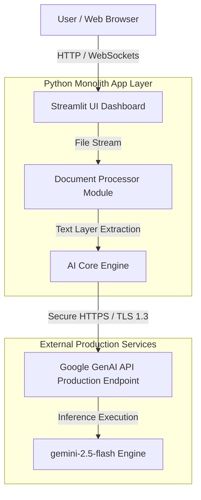

# ContractCompanion

An intelligent, full-stack AI legal document analyzer built with Python, Streamlit, and the modern Google GenAI SDK. ContractCompanion parses complex legal contracts (PDF, DOCX, TXT), extracts key entities, and flags high-risk legal vulnerabilities in seconds.

---

## Features
- **Multi-Format Document Parsing:** Custom text layer extraction for `.pdf`, `.docx`, and `.txt` agreements.
- **AI-Driven Risk Auditing:** Leverages `gemini-2.5-flash` to structure comprehensive executive summaries, identify critical contract dates, and pinpoint missing protections.
- **Streamlined Architecture:** Employs decoupling patterns separating document parsing, model invocation, and interface components.

---

## Tech Stack
- **Language:** Python 3.10+
- **Frontend Framework:** Streamlit
- **AI Integration:** Google GenAI SDK (`google-genai`)
- **Parsing Utilities:** PyPDF, `python-docx`

---

## Installation & Setup

### 1. Clone the Repository
```bash
git clone [https://github.com/leyla009/ContractCompanion-AI-Legal-Document-Analyser.git](https://github.com/leyla009/ContractCompanion-AI-Legal-Document-Analyser.git)
cd ContractCompanion-AI-Legal-Document-Analyser/apps/web-dashboard

### 2. Configure the Virtual Environment

```bash
# Create the environment
python3 -m venv venv

# Activate the environment
source venv/bin/activate
```

### 3. Install Project Dependencies
```bash
pip install -r requirements.txt
```

### 4. Set Up Environment Variables

Create a file named `.env` in the root of the `legal-analyser` folder to securely store your credentials:
```text
GOOGLE_API_KEY="your_actual_gemini_api_key_here"
```

## Us»age

Make sure your virtual environment is active, then spin up the server framework:

```bash
streamlit run app.py
```

---

## System Architecture


